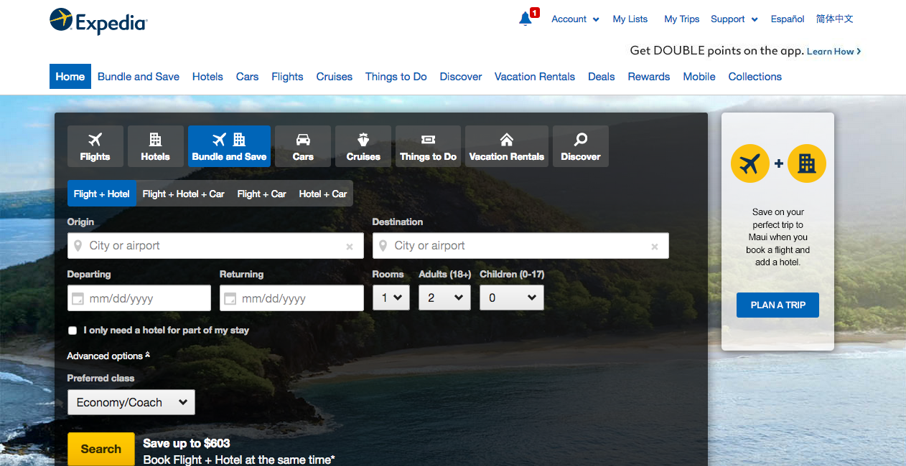

# Angular vs Vue
which one is the right choice for your project

## Angular

**Angular** is a *TypeScript-based* Javascript framework.
The history of Angular began in 2010 when the AngularJS framework was released by Google. In 2016 Angular 2 appeared, which was a complete rewrite of Angular JS. Together with Angular 4 and 5 released in 2017, these framework versions have become the main web development trends of the current year. And here are the reasons.
Angular is used by Google, Wix, weather.com, healthcare.gov and Forbes (according to madewithangular, stackshare and libscore.com).

### Top Apps and Websites Developed with Angular

#### [1. Upwork](https://www.upwork.com)

Upwork – the world’s biggest online marketplace where savvy businesses and professional freelancers go to work!

#### [2. iStock Photo](https://www.istockphoto.com)

iStock is an online portal, royalty free, global microstock photography provider operating with the micropayment business model. It provides millions of photos, illustrations, clip art, videos and audio tracks

#### [3. Lego](https://www.lego.com/en-us)

Lego is one of the world’s top manufacturers of play materials. It products are traded global and can be virtually explored at www.LEGO.com.

#### [4. Netflix](https://www.netflix.com)

Netflix is an American MNC entertainment company. It focuses in and offers streaming media and video on demand online and DVD by mail.

#### [5. Freelancer](https://www.freelancer.com)

Freelancer – the global leading online workplace where understanding businesses and professional service provider go to work!

#### [6. Weather](https://weather.com)

Weather.com is one of the top weather forecasting online report website. It’s also one the big websites using AngularJS.

#### [7. Youtube for Sony PS](https://www.playstation.com/en-us/explore/playstationnetwork/entertainment/youtube/)

It is a video hosting and sharing portal owned by Google. PS3 app was developed in Angular JS framework.

#### [8. jetBlue](https://www.jetblue.com)

jetBlue is one of the famous American airline company as online Airlines portal. Existing version of jetBlue website uses AngularJS

#### [9. The Guardian](https://www.theguardian.com/international)

The Guardian is leading in the design and publishing arena, sponsoring several awards in these areas. UI of The Guardian website is developed as an AngularJS app.

#### [10. PayPal](https://www.paypal.com)

Paypal is one of the worldwide leading Internet payment companies. It’s another example of large websites using AngularJS.

### Angular Pros
- MVC framework - Angular is a traditional **MVC** (Model-View-Controller) framework. Due to this structure, the application is divided into three interconnected components. This enables developers to write well-structured code, which is even more beneficial for complex projects.
- Simple implementation of two-way data binding - Two-way data binding means that any changes to the model affect the view, and vice versa when the view changes, the model is immediately changed as well. Angular allows simple two-way data binding, which is beneficial for simple applications. More complex apps will work faster with one-way data binding, which works only in one direction (view-to-model or model-to-view), depending on the needs of the software. This enables resources to be saved.
- Big community - Angular has a big community, which has been  forming since the release of AngularJS and became even stronger when version 2 was released. The framework has had over 1 million downloads in the last month on npm and over 26 thousands stars on Github. This popularity means the availability of various solutions that are compatible with different versions of Angular, as well as the possibility of receiving advice from experienced developers and users without needing to contact the official support.
- Modularity;
- Good code structure using components with modules;
- Dependency injection;
- There are many “pros” out of the box as a router, form validation, HttpClient, etc;
- The high level of control;
- Unlike React, Angular enables normal usage of HTML and CSS along with all their features and advantages.

### Angular Cons
- Heavyweight code
- It can be a little bit uneasy for inexperienced developers to work with it, especially when they have not got a sufficient background in JavaScript;
- A developer is limited if he/she wants to create a single-page application. There is no possibility to just drop it into your full stack or a multi-page application.

## Vue

Vue.js is a breath of fresh air and a framework that was launched in 2014 and 2016.

It is used for the creation of interactive interfaces. To imagine how it works, let’s picture that Vue.js is an extramarital child of Angular and React (a good deal of brilliant ideas from these two projects were successfully realized in Vue.js). The framework has been chosen by Alibaba, Nintendo, Expedia, and multiple other small projects.

### Top Apps and Websites Developed with Vue

#### [1. Alibaba](https://www.alibaba.com)

#### [2. Nintendo](https://www.nintendo.com/)

#### [3. Expedia](https://www.expedia.com)

### Vue Pros
- JavaScript code, templates, and CSS code are not mixed as they are in React;
- It is possible to use ES5, ES6, as well as TypeScript (yet it can be harder to set up);
- As with React, Vue quite easily interacts with other libraries or even projects;
- Vue’s documentation is quite comprehensible and well-structured. This makes it easy to get started.

### Vue cons
- Vue.js is at a disadvantage to Angular considering the modular concept (e.g., there is dependency injection);
- It’s relatively new and doesn’t have endorsement compared to Angular (backed by Google) and React (backed by Facebook).

## Conclusion
So what should you choose? To tell the truth, all options discussed here are quite beneficial. Nevertheless, it’s really hard to point out the best one. Just consider all the pros and cons and go with your gut.

Your solution is **Angular** if you are developing:
- Enterprise software - Angular is good for applications with a complex architecture
- Progressive web apps and hybrid mobile apps development
- Cross-platform mobile development
- If your app tends to get really large
- Like TypeScript;
- Like object-oriented-programing (OOP);
- Want to create a scalable app;
- Would like to engage many developers in the project;
- Work with designers and need clean HTML.

Your solution is **Vue.js** if you are developing:
- Dynamic high performance applications
- Are a fan of a clean code;
- Are looking for the simplest learning curve;
- Need a lightweight framework;
- Work alone or with a small team;
- Need clean HTML files.
